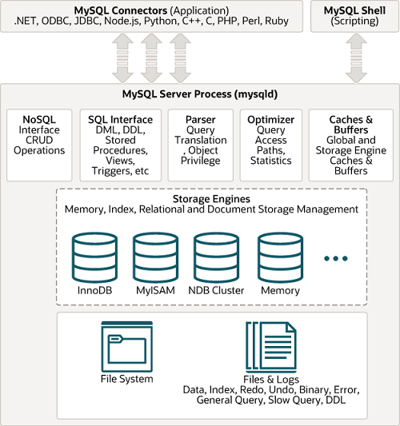

# 04. 아키텍처

## MySQL 엔진아키텍처

* MySQL 서버는 크게 MySQL 엔진과 스토리지 엔진으로 구분할 수 있다.

### MySQL 엔진
* MySQL 엔진은 클라이언트로부터의 접속 및 쿼리 요청을 처리하는 커넥션 핸들러와 SQL 파서 및 전처리기, 쿼리의 최적화된 실행을 위한 옵티마이저가 중심을 이룬다.

### 스토리지 엔진
* MySQL 엔진은 요청된 SQL 문장을 분석하거나 최적화하는 등 DBMS의 두뇌에 해당하는 처리를 수행한다.
* 실제 데이터를 디스크 스토리지에 저장하거나 디스크 스토리지로부터 데이터를 읽어오는 부분은 스토리지 엔진이 전담한다.
* MySQL 서버에서 MySQL 엔진은 하나지만 스토리지 엔진은 여러 개를 동시에 사용할 수 있다. (INNODB 등..)
* 테이블이 사용할 스토리지 엔진을 지정하면 이후 해당 테이블의 모든 Read/Write는 정의된 스토리지 엔진이 처리한다.

### 핸들러 API
* MySQL 엔진의 쿼리 실행기에서 데이터를 쓰거나 읽어야 할 떄는 각 스토리지 엔진에 쓰기 또는 읽기를 요청하는데, 이러한 요청을 핸들러 요청이라 하고, 여기서 사용되는 API를 핸들러 API라고 한다.
* InnoDB 스토리지 엔진 또한 이 핸들러 API를 이용해 MySQL 엔진과 데이터를 주고받는다.

## MySQL 스레딩 구조

* MySQL 서버는 스레드 기반으로 작동한다.
* 포그라운드(Foreground) 스레드와 백그라운드(Background) 스레드로 구분된다.
* 위의 스레드 모델은 MySQL 커뮤니티 에디션에서 사용되는 전통적인 모델이며, MySQL 엔터프라이즈 에디션과 Percona MySQL 서버에서는 전통적인 스레드 모델뿐 아니라 스레드 풀 모델을 사용할 수도 있다.
  * 전통적인 스레드 모델은 커넥션별로 포그라운드 스레드가 하나씩 생성되어 할당된다.
  * 스레드 폴에서는 커넥션과 포그라운드 스레드가 1:1 관계가 아니라 하나의 스레드가 여러 개의 커넥션 요청을 전담한다.

### 포그라운드 스레드
* MySQL 서버에 접속된 클라이언트 수만큼 존재한다.
* 주로 각 클라이언트가 요청하는 쿼리 문장을 처리한다.
* 클라이언트가 작업을 마치고 커넥션을 종료하면 해당 커넥션을 담당하던 스레드는 다시 스레드 캐시로 되돌아간다.
  * 이때 스레드 캐시에 일정 개수 이상의 대기 중인 스레드가 있으면 스레드 캐시에 넣지 않고 스레드를 종료시켜 일정 개수의 스레드만 스레드 캐시에 존재하게 된다.
* 데이터를 MySQL의 데이터 버퍼나 캐시로부터 가져오며, 버퍼나 캐시에 없는 경우에는 직접 디스크의 데이터나 인덱스 파일로부터 데이터를 읽어와서 작업을 처리한다.
* MyISAM 테이블은 디스크 쓰기 작업까지 포그라운드 스레드가 처리한다.
* InnoDB 테이블은 데이터 버퍼나 캐시까지만 포그라운드 스레드가 처리하고, 나머지 버퍼로부터 디스크까지 기록하는 작업은 백그라운드 스레드가 처리한다.

### 백그라운드 스레드
* InnoDB 는 다음과 같이 여러 작업이 백그라운드 스레드로 처리된다.
  * 인서트 버퍼(Insert Buffer)를 병합하는 스레드
  * 로그를 디스크로 기록하는 스레드
  * InnoDB 버퍼 풀의 데이터를 디스크에 기록하는 스레드
  * 데이터를 버퍼로 읽어 오는 스레드
  * 잠금이나 데드락을 모니터링하는 스레드
* 일반적인 DBMS는 데이터의 쓰기작업은 버퍼링을 통해 지연되어 처리될 수 있지만 읽기 작업은 지연되지 않으며, InnoDB도 마찬가지다.
  * 따라서 InnoDB에서는 CUD 쿼리로 데이터가 변경되는 경우 데이터가 디스크의 데이터 파일로 완전히 저장될 때까지 기다리지 않아도 된다.
  * MyISAM은 그렇지 않고, 포그라운드 스레드가 쓰기 작업까지 함께 처리하도록 설계돼 있다. (일반적인 쿼리는 쓰기 버퍼링 기능을 사용할 수 없다.)
  * 결론은 InnoDB를 쓰자.

## 메모리 할당 및 사용 구조

### 글로벌 메모리 영역
* 글로벌 메모리 영역의 모든 메모리 공간은 MySQL 서버가 시작되면서 운영체제로부터 할당된다.
* 일반적으로 클라이언트 스레드 수와 무관하게 하나의 메모리 공간만 할당된다.
  * 필요에 따라 2개 이상의 메모리 공간을 할당받을 수도 있지만 클라이언트 스레드 수와 무관하며, 생성된 글로벌 영역이 N개라 하더라도 모든 스레드에 의해 공유된다.

### 로컬 메모리 영역
* MySQL 서버상에 존재하는 클라이언트 스레드가 쿼리를 처리하는 데 사용하는 메모리 영역이다.
* 클라이언트와 MySQL 서버와의 커넥션을 세션이라고 하기 때문에 로컬 메모리 영역을 세션 메모리 영역이라고도 표현한다.
* 로컬 메모리는 각 클라이언트 스레드 별로 독립적으로 할당되며 절대 공유되어 사용되지 않는다.
* 각 쿼리의 용도별로 필요할 때만 공간이 할당되고 필요하지 않은 경우에는 MySQL이 메모리 공간을 할당조차 하지 않을 수도 있다. (소트 버퍼나 조인 버퍼 등..)
* 커넥션이 열려 있는 동안 계속 할당된 상태로 남아 있는 공간도 있다. (커넥션 버퍼나 결과 버퍼)

## MySQL 엔진과 스토리지 엔진 처리 영역

* MySQL에서 쿼리가 실행될 때, 거의 대부분의 작업이 MySQL 엔진에서 처리되고, 데이터 읽기/쓰기 작업만 스토리지 엔진에서 처리된다.
* MySQL 엔진이 각 스토리지 엔진에게 데이터를 읽어오거나 저장하도록 명령하려면 반드시 핸들러를 통해야 한다.
> 핸들러는 MySQL 엔진이 스토리지 엔진을 조정하기 위해 사용된다.
* GROUP BY나 ORDER BY 등 복잡한 처리는 스토리지 엔진 영역이 아니라 MySQL 엔진의 처리 영역인 '쿼리 실행기'에서 처리된다.

## 쿼리 실행 구조

### 쿼리 파서
* 사용자 요청으로 들어온 쿼리 문장을 토큰으로 분리해 트리 형태의 구조로 만든다.
* 쿼리 문장의 기본 문법 오류는 이 과정에서 발견되고 사용자에게 오류 메시지를 전달한다.

### 전처리기
* 파서 과정에서 만들어진 파서 트리를 기반으로 쿼리 문장에 구조적인 문제점이 있는지 확인한다. 
* 각 토큰을 테이블 이름이나 컬럼 이름, 또는 내장 함수와 같은 개체를 매핑해 해당 객체의 존재 여부와 객체의 접근 권한 등을 확인하는 과정을 수행한다.
* 실제 존재하지 않거나 권한상 사용할 수 없는 개체의 토큰은 이 단계에서 걸러진다.

### 옵티마이저
* 사용자의 요청으로 들어온 쿼리 문장을 어떻게 하면 저렴한 비용으로 가장 빠르게 처리할 수 있을지를 결정하는 역할을 담당한다.

### 실행 엔진
* 옵티마이저에 의해 만들어진 계획대로 각 핸들러에게 요청해서 받은 결과를 또 다른 핸들러 요청의 입력으로 연결하는 역할을 수행하고, 그 결과를 클라이언트에게 응답한다.

### 핸들러 (스토리지 엔진)
* MySQL 실행 엔진의 요청에 따라 데이터를 디스크로 저장하고 디스크로부터 읽어 오는 역할을 담당한다.

## InnoDB 스토리지 엔진 아키텍처

* InnoDB는 레코드 기반의 잠금을 제공한다. 덕분에 높은 동시성 처리가 가능하고 안정적이며 성능이 뛰어나다.

### 프라이머리 키에 의한 클러스터링
* InnoDB의 모든 테이블은 기본적으로 프라이머리 키를 기준으로 클러스터링되어 저장된다.
  * 프라이머리 키 값의 순서대로 디스크에 저장된다는 뜻이며, 모든 세컨더리 인덱스는 레코드의 주소 대신 프라이머리 키의 값을 논리적인 주소로 사용한다.
* 프라이머리 키가 클러스터링 인덱스이기 때문에 프라이머리 키를 이용한 레인지 스캔은 상당히 빨리 처리되고, 실행 계획에서 프라이머리 키는 기본적으로 다른 보조 인덱스에 비해 비중이 높게 설정된다.
* MyISAM 스토리지 엔진은 클러스터링 키를 지원하지 않으므로, 프라이머리 키와 세컨더리 인덱스는 구조적을 아무런 차이가 없다. (MyISAM은 쓰지말자.)
  * 프라이머리 키는 유니크 제약을 가진 세컨더리 인덱스일 뿐이다.
  * MyISAM은 프라이머리 키를 포함한 모든 인덱스가 물리적 레코드 주소 값(ROWID)를 가진다.

### 외래 키 지원
* 외래 키에 대한 지원은 InnoDB 스토리지 엔진 레벨에서 지원하는 기능으로 MyISAM이나 MEMORY 테이블에서는 사용할 수 없다.
* InnoDB에서 외래 키는 부모 테이블과 자식 테이블 모두 해당 컬럼에 인덱스 생성이 필요하고, 변경 시에는 부모 테이블이나 자식 테이블에 데이터가 있는지 체크하는 작업이 필요하므로 잠금이 여러 테이블로 전파되고, 그로 인해 데드락이 발생할 때가 많으므로 개발할 때도 외래 키의 존재에 주의해야 한다.

### MVCC (Multi Version Concurrency Control)
* 일반적으로 레코드 레벨의 트랜잭션을 지원하는 DBMS가 제공하는 기능이다.
* MVCC의 가장 큰 목적은 잠금을 사용하지 않는 일관된 읽기를 제공하는데 있다.
* InnoDB는 언두 로그(Undo Log)를 이용해 이 기능을 구현한다.

### Update해서 발생하는 변경 작업 및 절차

* 위와 같은 상태에서 아래의 쿼리가 실행되면 아래 그림과 같은 상태가 된다.
> UPDATE member SET m_area = '경기' WHERE m_id = 12;

* UPDATE 쿼리 수행 후, 커밋 실행 여부와 상관없이 InnoDB 버퍼 풀은 새로운 값으로 업데이트된다.
* 언두 로그 영역에는 업데이트 전 값만 InnoDB 버퍼 풀로부터 복사된다.
* 디스크의 데이터 파일에는 체크포인트나 InnoDB의 Write 스레드에 의해 새로운 값으로 업데이트돼 있을 수도 있고 아닐 수도 있다.

#### 아직 COMMIT이나 ROLLBACK이 되지 않은 상태에서 다른 사용자가 조회하면 어떤 영역의 데이터가 조회될까?
> SELECT * FROM member WHERE m_id = 12;

* MySQL 서버의 시스템 변수에 설정된 격리 수준에 따라 다르다.
* READ_UNCOMMITTED인 경우는 InnoDB 버퍼 풀이나 데이터 파일로부터 변경되지 않은 데이터를 읽어서 반환한다.
* READ_COMMITTED 이상의 격리 수준인 경우에는 아직 커밋되지 않았기 때문에 언두 영역의 데이터를 반환한다.
* 이러한 과정을 MVCC라고 표현한다.
* 예전 버전의 데이터는 무한히 많아질 수 있으며, 트랜잭션이 길어지면 언두에서 관리하는 예전 데이터가 삭제되지 못하고 오랫동안 관리돼야 한다.
  * 언두 영역이 저장되는 시스템 테이블 스페이스 공간이 많이 늘어나는 상황이 발생할 수도 있다.
* COMMIT 명령이 실행되면 InnoDB는 더 이상의 변경 작업 없이 지금의 상태를 영구적인 데이터로 만든다.
* 롤백을 실행하면 InnoDB는 언두 영역에 있는 백업된 데이터를 InnoDB 버퍼 풀로 다시 복구하고, 언두 영역의 내용을 삭제해 버린다.
* 커밋이 되었다고 언두 영역의 백업 데이터가 항상 바로 삭제되는 것은 아니고, 이 언두 영역을 필요로 하는 트랜잭션이 더는 없을 때 비로소 삭제된다.

### 잠금 없는 일관된 읽기 (Non-Locking Consistent Read)
* InnoDB 스토리지 엔진은 MVCC 기술을 이용해 잠금을 걸지 않고 읽기 작업을 수행한다.
* 잠금을 걸지 않기 때문에 InnoDB에서 읽기 작업은 다른 트랜잭션이 가지고 있는 잠금을 기다리지 않고, 읽기 작업이 가능하다.
* 격리 수준이 SERIALIZABLE이 아닌 READ_UNCOMMITTED나 READ_COMMITTED, REPEATABLE_READ 수준인 경우 INSERT와 연결되지 않은 순수한 SELECT 작업은 다른 트랜잭션의 변경 작업과 관계없이 항상 잠금을 대기하지 않고 바로 실행된다.
* 오랜 시간 동안 활성 상태인 트랜잭션으로 인해 MySQL 서버가 느려지거나 문제가 발생할 때가 가끔 있는데, 바로 이러한 일관된 읽기를 위해 언두 로그를 삭제하지 못하고 계속 유지해야 하기 때문에 발생하는 문제다.

### 자동 데드락 감지
* InnoDB 스토리지 엔진은 내부적으로 잠금이 교착 상태에 빠지지 않았는지 체크하기 위해 잠금 대기 목록을 그래프(Wait-for List) 형태로 관리한다.
* InnoDB 스토리지 엔진은 데드락 감지 스레드를 가지고 있어서 데드락 감지 스레드가 주기적으로 잠금 대기 그래프를 검사해 교착 상태에 빠진 트랜잭션들을 찾아서 그중 하나를 강제 종료한다.
  * 이때 어떤 트랜잭션을 먼저 강제 종료할 것인지를 판단하는 기준은 트랜잭션의 언두 로그 양이며, 언두 로그를 더 적게 가진 트랜잭션이 일반적으로 롤백의 대상이 된다.
  * 트랜잭션이 언두 레코드를 적게 가졌다는 이야기는 롤백을 해도 언두 처리를 해야할 내용이 적다는 것이며, 트랜잭션 강제 롤백으로 인한 MySQL 서버의 부하도 덜 유발하기 때문이다.

### InnoDB 버퍼 풀
* 디스크의 데이터 파일이나 인덱스 정보를 메모리에 캐시해 두는 공간이다.
* 쓰기 작업을 지연시켜 일괄 작업으로 처리할 수 있게 해주는 버퍼 역할도 같이 한다.
* 일반적인 애플리케이션에서 INSERT, UPDATE, DELETE처럼 데이터를 변경하는 쿼리는 디스크에 랜덤 액세스를 유발시켜 부하가 생길 수 있지만, 버퍼 풀이 이러한 변경 데이터를 모아서 배치처리하면 랜덤한 디스크 작업 횟수를 줄일 수 있다.
* InnoDB 버퍼 풀은 내부적으로 128MB 청크 단위로 쪼개어 관리된다.
* InnoDB 버퍼 풀은 여러 개의 작은 버퍼 풀로 쪼개어 관리된다.
* 여러 개의 작은 버퍼 풀로 쪼개지면서 개별 버퍼 풀 전체를 관리하는 잠금(세마포어) 자체도 경합이 분산되는 효과를 낸다.

### 버퍼 풀 구조
* InnoDB 스토리지 엔진은 버퍼 풀이라는 메모리 공간을 페이지 크기의 조각으로 쪼개어 InnoDB 스토리지 엔진이 데이터를 필요로 할 때 해당 데이터 페이지를 읽어서 각 조각에 저장한다.
* 버퍼 풀의 페이지 크기 조각을 관리하기 위해 InnoDB 스토리지 엔진은 크게 LRU(Least Recently Used) 리스트와 플러시(Flush) 리스트, 그리고 프리(Free) 리스트라는 3개의 자료 구조를 관리한다.

#### 프리 리스트
* InnoDB 버퍼 풀에서 실제 사용자 데이터로 채워지지 않은 비어 있는 페이지들의 목록이며, 사용자의 쿼리가 새롭게 디스크의 데이터 페이지를 읽어와야 하는 경우 사용된다.

#### LRU 리스트

* LRU 리스트는 위와 같은 구조로 되어 있으며, 엄밀하게 LRU와 MRU(Most Recently Used) 리스트가 결합된 형태라고 보면 된다.
* Old Sublist 영역은 LRU에 해당하며, New Sublist 영역은 MRU 정도로 이해하면 된다.
* LRU 리스트를 관리하는 목적은 디스크로부터 한 번 읽어온 페이지를 최대한 오랫동안 InnoDB 버퍼 풀의 메모리에 유지해서 디스크 읽기를 최소화 한다.
* 필요한 데이터가 자주 접근됐다면 해당 페이지의 인덱스 키는 어댑티브 해시 인덱스에 추가된다.
* 처음 한 번 읽힌 데이터 페이지가 이후 자주 사용된다면 그 데이터 페이지는 InnoDB 버퍼 풀의 MRU 영역에서 계속 살아남는다.
* 데이터 페이지가 거의 사용되지 않으면 새롭게 디스크에서 읽히는 데이터 페이지들에 밀려서 LRU의 끝으로 밀려나 결국은 InnoDB 버퍼 풀에서 제거된다.

#### 플러시 리스트
* 디스크로 동기화되지 않은 데이터를 가진 데이터 페이지(이를 더티 페이지라고 함)의 변경 시점 기준의 페이지 목록을 관리한다.
* 디스크에서 읽은 상태 그대로 변경이 없다면 플러시 리스트에서 관리되지 않고, 일단 한 번 변경이 가해진 데이터 페이지는 플러시 리스트에 관리되고 특정 시점이 되면 디스크로 기록돼야 한다.
* 데이터가 변경되면 InnoDB는 변경 내용을 리두 로그에 기록하고 버퍼 풀의 데이터 페이지에도 변경 내용을 반영한다.
  * 리두 로그의 각 엔트리는 특정 데이터 페이지와 연결된다.
  * 리두 로그가 디스크로 기록됐다고 해서 데이터 페이지가 디스크로 기록됐다는 것을 항상 보장하지는 않는다.
  * InnoDB 스토리지 엔진은 체크포인트를 발생시켜 디스크의 리두 로그와 데이터 페이지의 상태를 동기화한다.
  * 체크 포인트는 MySQL 서버가 시작될 때 InnoDB 스토리지 엔진이 리두 로그의 어느 부분부터 복구를 실행해야 할지 판단하는 기준점을 만드는 역할을 한다.

### 버퍼 풀과 리두 로그
* InnoDB의 버퍼 풀은 데이터베이스 서버의 성능 향상을 위해 데이터 캐시와 쓰기 버퍼링이라는 두 가지 용도가 있다.
* 버퍼 풀의 메모리 공간만 단순히 늘리는 것은 데이터 캐시 기능만 향상시키는 것이다.
* InnoDB 버퍼 풀은 디스크에서 읽은 상태로 변경되지 않은 클린 페이지와 INSERT, UPDATE, DELETE 명령으로 변경된 데이터를 가진 더티 페이지도 가지고 있다.
* 더티 페이지는 디스크와 메모리(버퍼 풀)의 데이터 상태가 다르기 때문에 언젠가는 디스크로 기록돼야 한다.
* 리두 로그 파일의 공간은 계속 순환되어 재사용되지만 매번 기록될 떄마다 로그 포지션은 게속 증가된 값을 갖는데, 이를 LSN(Log Sequence Number)라고 한다.
* InnoDB 스토리지 엔진은 주기적으로 체크포인트 이벤트를 발생시켜 리두 로그와 버퍼 풀의 더티 페이지를 디스크로 동기화하는데, 이렇게 발생한 체크포인트 중 가장 최근 체크포인트 지점의 LSN이 활성 리두 로그 공간의 시작점이 된다.
* 체크포인트가 발생하면 체크포인트 LSN보다 작은 리두 로그 엔트리와 관련된 더티 페이지와 리두 로그 엔트리는 디스크로 동기화된다.
* 일반적으로 리두 로그는 변경분만 가지고 버퍼 풀은 데이터 페이지를 통째로 가지기 때문에 데이터 변경이 발생해도 리두 로그는 훨씬 작은 공간만 있으면 된다.

## 언두 로그
* InnoDB 스토리지 엔진은 트랜잭션과 격리 수준을 보장하기 위해 DML로 변경되기 이전 버전의 데이터를 별도로 백업한다. 이러한 백업 데이터를 언두 로그(Undo Log)라고 한다.
* 언두 로그는 트랜잭션이 롤백되면 트랜잭션 도중 변경된 데이터를 변경 전 데이터로 복구해야 하는데, 이때 언두 로그에 백업해둔 이전 버전의 데이터를 이용해 복구한다.
* 특정 커넥션에서 데이터를 변경하는 도중에 다른 커넥션에서 데이터를 조회하면 트랜잭션 격리 수준에 맞게 변경 중인 데이터를 읽지 않고 언두 로그에 백업해둔 데이터를 읽어서 반환하기도 한다.
* 언두 로그는 트랜잭션의 격리 수준을 유지하면서 높은 동시성을 제공할 수 있도록 한다.
* 트랜잭션이 오랜 시간 동안 실행될 때 언두 로그의 양이 급격히 증가할 수 있고, 이러한 레코드를 조회하는 쿼리가 실행되면 언두 로그의 이력을 필요한 만큼 스캔해야 하므로 성능이 떨어질 수 있다.

## 체인지 버퍼
* 데이터가 INSERT 되거나 UPDATE될 때 데이터 파일을 변경하는 작업뿐 아니라 해당 테이블에 포함된 인덱스도 업데이트하는 작업이 필요한데, 이러한 인덱스 업데이트 작업은 랜덤하게 디스크를 읽는 작업이 필요하므로 테이블 인덱스가 많다면 상당히 많은 작업을 소모하게 된다.
* InnoDB는 변경해야 할 인덱스 페이지가 버퍼 풀에 있으면 바로 업데이트를 수행하지만 그렇지 않고 디스크로부터 읽어와서 업데이트해야 한다면 이를 즉시 실행하지 않고 임시 공간에 저장해 두는데, 이때 사용하는 임시 메모리를 체인지 버퍼라고 한다.
* 중복 여부를 체크해야 하는 유니크 인덱스는 체인지 버퍼를 사용할 수 없다.
* 체인지 버퍼에 임시로 저장된 인덱스 레코드 조각은 이후 백그라운드 스레드에 의해 병합되는데, 이 스레드를 버퍼 머지 스레드라고 한다.

## 리두 로그 및 로그 버퍼
* 리두 로그는 트랜잭션의 4가지 요소인 ACID 중에서 D(Durable)에 해당하는 영속성과 밀접하게 연관돼 있다.
* 리두 로그는 하드웨어나 소프트웨어 등 여러 가지 문제점으로 인해 MySQL 서버가 비정상적으로 종료됐을 때 데이터 파일에 기록되지 못한 데이터를 잃지 않게 해주는 안전장치다.
* MySQL 서버를 포함한 대부분 데이터베이스 서버는 데이터 변경 내용을 로그로 먼저 기록한다.
* 거의 모든 DBMS에서 데이터 파일은 쓰기보다 읽기 성능을 고려한 자료 구조를 가지고 있기 때문에 데이터 파일 쓰기는 랜덤 액세스가 필요하다. 그래서 변경된 데이터를 데이터 파일에 기록하려면 상대적으로 큰 비용이 든다.
* 이로 인한 성능 저하를 막기 위해 데이터베이스 서버는 쓰기 비용이 낮은 자료 구조를 가진 리두 로그를 가지고 있으며, 비정상 종료가 발생하면 리두 로그의 내용을 이용해 데이터 파일을 다시 서버가 종료되기 직전의 상태로 복구한다.

## 어댑티브 해시 인덱스
* 어댑티브 해시 인덱스는 InnoDB 스토리지 엔진에서 사용자가 자주 요청하는 데이터에 대해 자동으로 생성하는 인덱스이다.
* 자주 읽히는 데이터 페이지의 키 값을 이용해 해시 인덱스를 만들고, 필요할 때마다 어댑티브 해시 인덱스를 검색해서 레코드가 저장된 데이터 페이지를 즉시 찾아갈 수 있다.
  * B-Tree를 루트 노드부터 리프 노드까지 찾아가는 비용이 없어지고 그만큼 CPU는 적은 일을 하지만 쿼리의 성능은 빨리진다.
* 어댑티브 해시 인덱스는 테이블의 삭제 작업에도 큰 영향을 미치는데, 테이블을 삭제하거나 변경하는 경우에 InnoDB 스토리지 엔진은 이 테이블이 가진 모든 데이터 페이지의 내용을 어댑티브 해시 인덱스에서 제거해야 한다.
  * 이로 인해 상당히 많은 CPU 자원을 사용하고, 그만큼 데이터베이스 서버의 처리 성능이 느려진다.

### 어댑티브 해시 인덱스가 성능 향상에 크게 도움이 되지 않는 경우]
* 디스크 읽기가 많은 경우
* 특정 패턴의 쿼리가 많은 경우(조인이나 LIKE패턴 검색)
* 매우 큰 데이터를 가진 테이블의 레코드를 폭넓게 읽는 경우

### 어댑티브 해시 인덱스가 성능 향상에  도움이 되는 경우
* 디스크의 데이터가 InnoDB 버퍼 풀 크기와 비슷한 경우(디스크 읽기가 많지 않은 경우)
* 동등 조건 검색(동등 비교와 IN 연산자)이 많은 경우
* 쿼리가 데이터 중에서 일부 데이터에만 집중되는 경우

## MyISAM 스토리지 엔진 아키텍처
* InnoDB의 버퍼 풀과 비슷한 역할을 하는 키 캐시를 가지고 있다.
* 키 캐시는 인덱스만을 대상으로 작동하며, 인덱스의 디스크 쓰기 작업에 대해서만 부분적으로 버퍼링 역할을 한다.

### 운영체제의 캐시 및 버퍼
* MyISAM 테이블의 인덱스는 키 캐시를 이용해 디스크를 검색하지 않고도 빠른 검색이 가능하다.
* MyISAM 테이블의 데이터에 대해서는 디스크로부터의 I/O를 해결해 줄 만한 캐시나 버퍼링 기능을 가지고 있지 않다.
  * MyISAM 테이블의 데이터 읽기나 쓰기 작업은 항상 운영체제의 디스크 읽기 또는 쓰기 작업으로 요청될 수밖에 없다.
  * 운영체제에서는 디스크로부터 읽고 쓰는 파일에 대한 캐시나 버퍼링 메커니즘을 탑재하고 있기 때문에 MySQL 서버가 요청하는 디스크 읽기 작업을 위해 매번 디스크의 파일을 읽지는 않는다.
* 운영체제의 캐시 기능은 InnoDB처럼 데이터의 특성을 알고 전문저그올 캐시나 버퍼링을 하지는 못하지만, 없는 것보다는 낫다.
* 운영체제의 캐시 공간은 남는 메모리를 사용하는 것이 기본 원칙이다. 전체 메모리가 8GB인데 MySQL이나 다른 애플리케이션에서 메모리를 모두 사용해 버린다면 운영체제가 캐시 용도로 사용할 수 있는 메모리 공간이 없어지는 것이다.

### 데이터 파일과 프라이머리 키 구조
* InnoDB스토리지 엔진을 사용하는 테이블은 프라이머리 키에 의해서 클러스터링되어 저장되는 반면, MyISAM 테이블은 프라이머리 키에 의한 클러스터링 없이 데이터 파일이 힙 공간처럼 활용된다.
  * 즉, MyISAM 테이블에 레코드는 프라이머리 키 값과 무관하게 INSERT되는 순서대로 데이터 파일에 저장되는 것이다.
* MyISAM 테이블에 저장되는 레코드는 모두 ROWID라는 물리적인 주소값을 가지는데, 프라이머리 키와 세컨더리 인덱스는 모두 데이터 파일에 저장된 레코드의 ROWID 값을 포인터로 가진다.
* MyISAM이나 MEMORY 스토리지 엔진에서는 테이블 단위의 잠금을 사용하고 MVCC와 같은 메커니즘이 없다.
