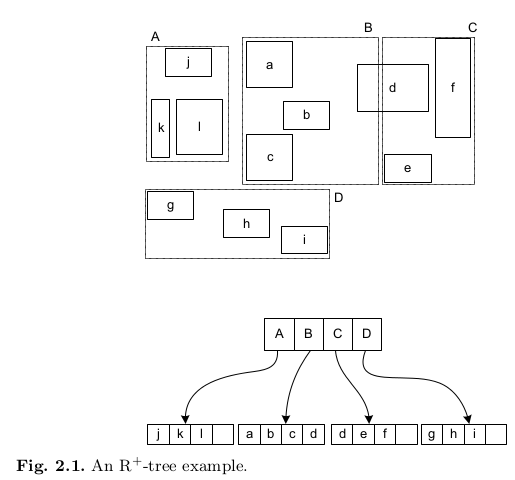

# Chapter 8. 인덱스

## 디스크 읽기 방식
* 데이터베이스의 성능 튜닝은 어떻게 디스크 I/O를 줄이느냐가 관건일 때가 상당히 많다.

### 하드 디스크 드라이브(HDD)와 솔리드 스테이트 드라이브(SSD)
* 컴퓨터에서 CPU나 메모리 같은 주요 장치는 대부분 전자식 장치지만 하드 디스크 드라이브는 기계식 장치다.
  * 데이터베이스 서버에서 항상 디스크 장치가 병목이 되는 원인이다.
* SSD는 기존 HDD에서 데이터 저장용 플래터(원판)를 제거하고 그 대신 플래시 메모리를 장착하고 있다.
  * 디스크 원판을 기계적으로 회전시킬 필요가 없으므로 HDD보다 빠르게 데이터를 읽을 수 있다. (컴퓨터의 메모리보다는 느리다.)
* SSD의 장점은 기존 하드 디스크 드라이브보다 랜덤 I/O가 훨씬 빠르다는 것이다.
* 데이터베이스 서버에서 순차 I/O 작업은 그다지 비중이 크지 않고 랜덤 I/O를 통해 작은 데이터를 읽고 쓰는 작업이 대부분이므로 SSD는 DBMS용 스토리지로 적합하다.

### 랜덤 I/O와 순차 I/O
* 디스크의 성능은 디스크 헤더의 위치 이동 없이 얼마나 많은 데이터를 한 번에 기록하느냐에 의해 결정된다.
  * 여러 번 쓰기 또는 읽기 요청하는 랜덤 I/O 작업이 부하가 훨씬 크다.
* 데이터베이스 대부분의 작업은 이러한 작은 데이터를 빈번히 읽고 쓰기 때문에 MySQL 서버는 그룹 커밋이나 바이너리 로그 버퍼 또는 InnoDB 로그 버퍼 등의 기능이 내장돼 있다.
* 쿼리를 튜닝해서 랜덤 I/O를 순차 I/O로 바꿔서 실행할 방법은 그다지 많지 않다.
  * 일반적으로 쿼리를 튜닝하는 것은 랜덤 I/O 자체를 줄여주는 것이 목적이라고 할 수 있다.
  * 랜덤 I/O를 줄인다는 것은 쿼리를 처리하는 데 꼭 필요한 데이터만 읽도록 쿼리를 개선하는 것을 의미한다.
> 디스크 원판을 가지지 않는 SSD는 랜덤 I/O와 순차 I/O의 차이가 없을 것 같지만, 실제로는 SSD에서도 랜덤 I/O가 순차 I/O보다 전체 스루풋(Throughput)이 떨어진다.
```text
인덱스 레인지 스캔은 데이터를 읽기 위해 주로 랜덤 I/O를 사용하며, 풀테이블 스캔은 순차 I/O를 사용한다.
그래서 큰 테이블의 레코드 대부분을 읽는 작업에서는 인덱스를 사용하지 않고 풀 테이블 스캔을 사용하도록 유도할 때도 있다.
순차 I/O가 랜덤 I/O보다 훨씬 빠른 속도로 레코드를 읽을 수 있기 때문이다.
이런 형태는 주로 OLTP 성격의 웹 서비스보다는 데이터 웨어하우스나 통계작업에서 주로 사용된다.
```

## 인덱스
* 컬럼의 값을 주어진 순서로 미리 정렬해서 보관하는 것이다.
* DBMS의 인덱스는 SortedList와 같은 자료 구조이며, ArrayList는 데이터 파일과 같은 자료 구조를 사용한다.
* DBMS의 인덱스는 SortedList처럼 저장되는 컬럼의 값을 이용해 항상 정렬된 상태를 유지한다.
* 데이터 파일은 ArrayList와 같이 저장된 순서대로 별도의 정렬 없이 저장한다.
* SortedList는 데이터가 저장될 때마다 항상 값을 정렬해야 하므로 저장하는 과정이 복잡하고 느리지만, 읽기 연산에서는 이미 정렬이 되어 있기 떄문에 빠른 성능을 보인다.
* 결과적으로 DBMS에서 인덱스는 데이터의 저장(CUD) 성능을 희생하고, 데이터의 읽기 속도를 높이는 기능이다.
* 데이터 저장 방식의 대표적인 구조는 B-Tree 인덱스와 Hash 인덱스로 구분할 수 있다.
* 데이터의 중복 허용 여부로 분류하면 유니크 인덱스와 유니크하지 않은 인덱스로 구분할 수 있다.
  * 유니크의 여부는 같은 값이 1개만 존재하는지 1개 이상 존재할 수 있는지를 의미하지만, 옵티마이저에겐 중요한 정보이다.
  * 유니크 인덱스에 대해 동등 조건으로 검색한다는 것은 항상 1건의 레코드만 찾으면 더이상 찾지 않아도 된다는 것을 옵티마이저에게 알려주는 효과를 낸다.

## B-Tree 인덱스
* 컬럼의 원래 값을 변형시키지 않고 인덱스 구조체 내에서는 항상 정렬된 상태로 유지한다.
* 전문 검색과 같은 특수한 요건이 아닌 경우, 대부분 인덱스는 거의 B-Tree를 사용할 정도로 일반적인 용도로 적합하다.

### B-Tree의 구조 및 특성
* 트리 구조의 최상위에 루트 노드가 존재하고 그 하위에 자식 노드가 붙어 있는 형태다.
* 트리 구조의 가장 하위에 있는 노드를 리프 노드라 하고, 트리 구조에서 루트 노드도 아니고 리프 노드도 아닌 중간 노드를 브랜치 노드라고 한다.
* 데이터베이스에서 인덱스와 실제 데이터가 저장된 데이터는 따로 관리되는데, 인덱스의 리프 노드는 항상 실제 데이터 레코드를 찾아가기 위한 주솟값을 가지고 있다.
* 인덱스의 키 값은 모두 정렬돼 있지만, 데이터 파일의 레코드는 정렬돼 있지 않고 임의의 순서로 저장돼 있다.
> 대부분 RDBMS의 데이터 파일에서 레코드는 특정 기준으로 정렬되지 않고 임의의 순서로 저장된다. 하지만 InnoDB 테이블에서 레코드는 클러스터되어 디스크에 저장되므로 기본적으로 프라이머리 키 순서로 정렬되어 저장된다.
* 인덱스는 테이블의 키 컬럼만 가지고 있으므로 나머지 컬럼을 읽으려면 데이터 파일에서 해당 레코드를 찾아야 한다.
  * 이를 위해 인덱스의 리프 노드는 데이터 파일에 저장된 레코드의 주소를 가진다.
  * MyISAM 테이블은 세컨더리 인덱스가 물리적인 주소를 가지는 반면, InnoDB 테이블은 프라이머리 키를 주소처럼 사용하기 때문에 논리적인 주소를 가진다.
* InnoDB 테이블에서 인덱스를 통해 레코드를 읽을 때는 데이터 파일을 바로 찾아가지 못한다.
  * 인덱스에 저장돼 있는 프라이머리 키 값을 이용해 프라이머리 키 인덱스를 한 번 더 검색한 후, 프라이머리 키 인덱스의 리프 페이지에 저장되어 있는 레코드를 읽는다.
  * 즉, InnoDB 스토리지 엔진에서는 모든 세컨더리 인덱스 검색에서 데이터 레코드를 읽기 위해서는 반드시 프라이머리 키를 저장하고 있는 B-Tree를 다시 한 번 검색해야 한다.


### B-Tree 인덱스 키 추가
* 새로운 키 값이 B-Tree에 저장될 때 테이블의 스토리지 엔진에 따라 새로운 키 값이 즉시 인덱스에 저장될 수도 있고 그렇지 않을 수도 있다.
* B-Tree에 저장될 때는 저장할 키 값을 이용해 B-Tree상의 적절한 위치를 검색해야 한다.
* 저장될 위치가 결정되면 레코드의 키 값과 대상 레코드의 주소 정보를 B-Tree의 리프 노드에 저장한다.
* 리프 노드가 꽉 차서 더는 저장할 수 없을 때는 리프 노드가 분리(Split)돼야 하는데, 이는 상위 브랜치 노드까지 처리의 범위가 넓어진다.
  * 이러한 작업 탓에 B-Tree는 상대적으로 쓰기 작업(새로운 키를 추가하는 작업)에 비용이 많이 든다.
* MyISAM이나 MEMORY 스토리지 엔진을 사용하는 테이블에서는 INSERT 문장이 실행됨녀 즉시 새로운 키 값을 B-Tree 인덱스에 변경한다.
* InnoDB 스토리지 엔진은 필요하다면 인덱스 키 추가 작업을 지연시켜서 나중에 처리할 수 있다.
  * 프라이머리 키나 유니크 인덱스의 경우 중복 체크가 필요하기 때문에 즉시 B-Tree에 추가되거나 삭제한다.

### B-Tree 인덱스 키 삭제
* 해당 키 값이 저장된 B-Tree의 리프 노드를 찾아서 삭제 마크만 하면 작업이 완료되므로 간단하다.
* 삭제 마킹된 인덱스 키 공간은 계속 그대로 방치하거나 재활용할 수 있다.
* 인덱스 키 삭제로 인한 마킹 작업 또한 디스크 쓰기가 필요하므로 디스크 I/O가 발생한다.
* MySQL 5.5 이상 버전의 InnoDB 스토리지 엔진에서는 버퍼링되어 지연 처리될 수도 있다.
  * MyISAM이나 MEMORY 스토리지 엔진의 테이블에는 체인지 버퍼와 같은 기능이 없으므로 인덱스 키 삭제가 완료된 후 쿼리 실행이 완료된다.

### 인덱스 키 변경
* 인덱스의 키 값은 그 값에 따라 저장될 리프 노드의 위치가 결정되므로 B-Tree의 키 값이 변경되는 경우에는 단순히 인덱스상의 키 값만 변경할 수 없다.
* B-Tree의 키 값 변경 작업은 먼저 키 값을 삭제한 후, 다시 새로운 키 값을 추가하는 형태로 처리된다.
* InnoDB 스토리지 엔진을 사용하는 테이블에 대해서는 체인지 버퍼를 활용해 지연 처리될 수 있다.

### 인덱스 키 검색
* 인덱스를 검색하는 작업은 B-Tree의 루트 노드부터 시작해 브랜치 노드를 거쳐 최종 리프 노드까지 이동하면서 비교 작업을 수행하는데, 이를 '트리 탐색'이라 한다.
* 인덱스 트리 탐색은 SELECT에서만 사용하는 것이 아니라 UPDATE나 DELETE를 처리하기 위해 항상 해당 레코드를 먼저 검색해야 할 경우에도 사용된다.
* B-Tree 인덱스를 이용한 검색은 100% 일치 또는 값의 앞부분만 일치하는 경우에 사용할 수 있다.
* 부등호("<, >") 비교 조건에서도 인덱스를 활용할 수 있지만, 인덱스를 구성하는 키 값의 뒷부분만 검색하는 용도로는 인덱스를 사용할 수 없다.
* InnoDB 테이블에서 지원하는 레코드 잠금이나 넥스트 키락(갭락)이 검색을 수행한 인덱스를 잠근 후 테이블의 레코드를 잠그는 방식으로 구현되어 있다.
  * UPDATE나 DELETE 문장이 실행될 때 테이블에 적절히 활용할 수 있는 인덱스가 없으면 불필요하게 많은 레코드를 잠그게 된다.

## B-Tree 인덱스 사용에 영향을 미치는 요소

### 인덱스 키 값의 크기
* InnoDB 스토리지 엔진은 디스크에 데이터를 저장하는 기본 단위는 페이지(Page) 또는 블록(Block)이라고 한다.
  * 디스크의 모든 I/O 작업의 최소 작업 단위다.
  * 버퍼 풀에서 데이터를 버퍼링하는 기본 단위다.
* 인덱스는 페이지 단위로 관리된다.
* B-Tree의 자식 노드 개수는 인덱스의 페이지 크기와 키 값의 크기에 따라 결정된다.
* 인덱스를 구성하는 키 값의 크기가 커지면 디스크로부터 읽어야 하는 횟수가 증가하고, 그에 따라 성능이 느려진다.

### B-Tree 깊이
* B-Tree 인덱스의 깊이는 중요하지만 제어할 방법은 없다.
* B-Tree의 깊이는 값을 검색할 때 디스크에서 랜덤 액세스가 얼마나 발생하는지와 직결된다.
  * 인덱스 키 값의 크기가 커지면 하나의 인덱스 페이지에 담을 수 있는 인덱스 키 값의 개수가 적어지고, 같은 레코드 건수라도 B-Tree의 깊이가 깊어져서 디스크 읽기가 더 많이 필요해진다.
* 인덱스 키 값의 크기는 작게 만드는 것이 좋다.

### 선택도(기수성)
* 인덱스에서 선택도(Selectivity) 또는 기수성(Cardinality)은 거의 같은 의미로 사용된다.
* 기수성은 모든 인덱스 키 값 가운데 유니크한 값의 수를 의미한다.
  * 기수성이 높다는 것은 그만큼 유니크한 값의 수가 많다는 의미하고, 검색 대상이 줄어들기 때문에 성능이 빨라진다.

### 읽어야 하는 레코드의 건수
* 인덱스를 통해 테이블의 레코드를 읽는 것은 인덱스를 거치지 않고 바로 테이블을 읽는 것보다 높은 비용이 든다.
* 일반적인 DBMS의 옵티마이저는 인덱스를 통해 레코드를 1건 읽는 것이 테이블에서 직접 레코드 1건을 읽는 것보다 4~5배 정도의 비용이 더 드는 작업으로 예측한다.
  * 인덱스를 통해 읽어야 할 레코드의 건수가 전체 테이블 레코드의 20~25%를 넘어서면 인덱스를 이용하지 않고 테이블을 모두 직접 읽어서 필요한 레코드만 필터링하는 방식으로 처리하는 것이 더 효율적이다.

## B-Tree 인덱스가 데이터를 읽는 방법

### 인덱스 레인지 스캔
* 인덱스 레인지 스캔은 검색해야 하는 인덱스의 범위가 결정됐을 때 사용하는 방법이다.
* 루트 노드에서부터 비교를 시작해 브랜치 노드를 거치고 최종적으로 리프 노드까지 찾는다.
* 리프 노드의 끝까지 읽으면 리프 노드 간의 링크를 이용해 다음 리프 노드를 찾아서 다시 스캔한다.
* 스캔의 결과로 해당 인덱스를 구성하는 컬럼의 정순 또는 역순으로 정렬된 상태로 가져오는데, 별도로 정렬을 수행한 것이 아니라 인덱스 자체가 정렬되어 있기 때문이다.
* 리프 노드에 저장된 레코드 주소로 데이터 파일의 레코드를 읽어올 때 레코드 단위로 랜덤 I/O가 한 번씩 일어난다.
  * 인덱스를 통해 데이터 레코드를 읽는 작업이 비용이 많이 드는 이유이다.

#### 인덱스 레인지 스캔 절차
1. 인덱스 조건을 만족하는 값이 저장된 위치를 찾는다. 이 과정을 인덱스 탐색이라고 한다. (Index seek)
2. 1번에서 탐색된 위치부터 필요한 만큼 인덱스를 차례대로 읽는다. 이 과정을 인덱스 스캔이라고 한다. (Index scan)
3. 2번에서 읽어 들인 인덱스 키와 레코드 주소를 이용해 레코드가 저장된 페이지를 가져오고, 최종 레코드를 읽어온다.

* 쿼리가 필요로 하는 데이터에 따라 3번 과정은 필요하지 않을 수도 있는데, 이를 커버링 인덱스라고 한다.
* 커버링 인덱스는 디스크의 레코드를 읽지 않아도 되기 때문에 랜덤 읽기가 상당히 줄어들고 성능은 그만큼 빨라진다.

### 인덱스 풀 스캔
* 인덱스의 처음부터 끝까지 모두 읽는 방식이다.
* 대표적으로 쿼리의 조건절에 사용된 컬럼이 인덱스의 첫 번째 컬럼이 아닌 경우에 사용된다.
  * (A, B, C) 컬럼 순서로 인덱스가 만들어져 있지만 쿼리 조건절은 B컬럼이나 C컬럼으로 검색하는 경우다.
* 일반적으로는 인덱스의 크기가 테이블의 크기보다 작으므로 직접 테이블을 처음부터 끝까지 읽는 것보다 인덱스만 읽는 것이 더 효율적이다.
  * 쿼리가 인덱스에 명시된 컬럼만으로 조건을 처리할 수 있는 경우 이 방식이 사용된다.
  * 인덱스 뿐만 아니라 데이터 레코드까지 읽어야 하면 인덱스만 읽는 방식으로 처리되지 않는다.

### 루스 인덱스 스캔
* '인덱스 레인지 스캔'과 '인덱스 풀 스캔'은 루스 인덱스 스캔과 상반된 의미에서 '타이트(Tight) 인덱스 스캔'으로 분류한다.
* 루스 인덱스 스캔이란 말 그대로 느슨하게 또는 듬성듬성하게 인덱스를 읽는 것을 의미한다.
* 인덱스 레인지 스캔과 비슷하게 동작하지만 중간에 필요치 않은 인덱스 키 값은 무시하고 다음으로 넘어가는 형태로 처리한다.
* 일반적으로 Group BY 또는 집합 함수 가운데 MAX() 또는 MIN() 함수에 대해 최적화를 사용하는 경우에 사용한다.

### 인덱스 스킵 스캔
* MySQL 8.0 버전 이전에는 인덱스 검색에서 선행 컬럼이 조건절에 없으면 인덱스를 사용하지 못한다.
* MySQL 8.0 버전 이후에는 인덱스의 선행 컬럼이 조건절에 존재하지 않아도 인덱스를 사용할 수 있게 해주는 인덱스 스킵 스캔 최적화 기능이 도입됐다.
* 루스 인덱스 스캔과 비슷하지만 루스 인덱스 스캔은 GROUP BY 작업을 처리하기 위해 인덱스를 사용하는 경우에만 적용할 수 있다.
* WHERE 조건절에 조건이 없는 인덱스의 선행 컬럼의 유니크한 값의 개수가 적어야 한다.
* 쿼리가 인덱스에 존재하는 컬럼만으로 처리 가능해야 한다. (커버링 인덱스)
* 유니크한 값의 개수가 많다면 MySQL 옵티마이저는 인덱스에서 스캔해야 할 시적 지점을 검색하는 작업이 많이 필요해진다.

## 다중 컬럼 인덱스
* 두 개 이상의 컬럼으로 구성된 인덱스를 다중 컬럼 인덱스(또는 복합 컬럼 인덱스)라고 한다.
* 후행 컬럼은 선행 컬럼에 의존해서 정렬돼 있다.

## B-Tree 인덱스의 정렬 및 스캔 방향
* 인덱스를 생성할 때 설정한 정렬 규칙에 따라서 인덱스의 키 값은 항상 오름차순이거나 내림차순으로 정렬되어 저장된다.
  * 인덱스가 오름차순으로 생성됐다고 해서 그 인덱스를 오름차순으로만 읽을 수 있다는 뜻은 아니다.
  * 그 인덱스를 거꾸로 끝에서부터 읽으면 내림차순으로 정렬된 인덱스로도 사용될 수 있다.
* 인덱스를 어느 방향으로 읽을지는 쿼리에 따라 옵티마이저가 실시간으로 만들어내는 실행 계획에 따라 결정된다.

### 인덱스의 정렬
* MySQL 5.7 버전까지는 컬럼 단위로 정렬 순서를 혼합(ASC와 DESC 혼합)해서 인덱스를 생성할 수 없었다.
  * 이런 문제점을 해결하기 위해 숫자 컬럼에는 -1을 곱한 값을 저장하는 우회 방법을 사용했었다.
* MySQL 8.0 버전 부터는 다음과 같은 형태의 정렬 순서를 혼합한 인덱스 생성이 가능하다.
```sql
CREATE INDEX ix_teamname_userscore ON employees (team_name ASC, user_score DESC);
```
* MySQL 5.7 버전에서도 위와 같은 인덱스 생성 시, 에러 없이 인덱스가 생성되는데, 이는 실제로 오름차순 정렬로만 인덱스가 생성된 것이다.
  * 단순히 ASC 또는 DESC 키워드는 앞으로 만들어질 버전에 대한 호환성을 위해 문법상으로 제공된 것이다.

### 인덱스 스캔 방향
* 인덱스는 오름차순으로 정렬돼 있지만 인덱스를 최소값부터 읽으면 오름차순으로 값을 가져올 수 있고, 최댓값부터 거꾸로 읽으면 내림차순으로 값을 가졍로 수 있다는 것을 MySQL 옵티마이저는 이미 알고 있다.
* 인덱스 생성 시점에 오름차순 또는 내림차순으로 정렬이 결정되지만 쿼리가 그 인덱스를 사용하는 시점에 인덱스를 읽는 방향에 따라 오름차순 또는 내림차순 정렬 효과를 얻을 수 있다.
* 쿼리의 ORDER BY 처리나 MIN() 또는 MAX() 함수 등의 최적화가 필요한 경우에도 MySQL 옵티마이저는 인덱스의 읽기 방향을 전환해서 사용하도록 실행 계획을 만든다.

### 내림차순 인덱스
```sql
CREATE INDEX ix_teamname_userscore ON employees (team_name ASC, user_score DESC);
```
* 위와 같이 2개 이상의 컬럼으로 구성된 복합 인덱스에서 각각의 컬럼이 내림차순과 오름차순이 혼합된 경우에는 MySQL 8.0의 내림차순 인덱스로만 해결될 수 있다.
* MySQL 서버의 InnoDB 스토리지 엔진에서 정순 스캔과 역순 스캔은 페이지(블록) 간의 양방향 링크드 리스트(Double linked list)를 통해 Forward하느냐 Backward하느냐의 차이만 있지만, 실제 내부적으로는 InnoDB에서 인덱스 역순 스캔이 인덱스 정순 스캔에 비해 느릴 수 밖에 없다.
  * 페이지 잠금이 인덱스 정순 스캔에 적합한 구조이기 때문이다.
  * 페이지 내에서 인덱스 레코드가 단방향으로만 연결된 구조이기 때문이다.
* InnoDB의 페이지는 내부에서 힙처럼 사용되기 때문에 레코드들이 정렬 순서대로 저장되어 있지 않고, 물리적으로 저장이 순서대로 배치되지 않는다.
* 일반적으로 인덱스를 ORDER BY ... DESC 하는 쿼리가 소량의 레코드를 드물게 실행하는 경우라면 내림차순 인덱스를 굳이 고려할 필요는 없다.
  * 하지만 해당 쿼리가 빈번하게 발생한다면 오름차순 인덱스보다는 내림차순 인덱스가 더 효율적이다.
* 많은 쿼리가 인덱스의 앞쪽만 또는 뒤쪽만 집중적으로 읽어서 인덱스의 특정 페이지 잠금이 병목이 될 것으로 예상된다면 쿼리에서 자주 사용되는 정렬 순서대로 인덱스를 생성하는 것이 잠금 병목 현상을 완화하는 데 도움이 될 것이다.

### 비교 조건의 종류와 효율성
* 다중 컬럼 인덱스에서 각 컬럼의 순서와 그 컬럼에 사용된 조건이 동등 비교("=")인지 아니면 크다(">") 또는 작다("<") 같은 범위 조건에 따라 각 인덱스 컬럼의 활용 형태가 달라진다.
* 인덱스를 통해 읽을 레코드가 나머지 조건에 맞는지 비교하면서 선택하는 작업을 '필터링'이라고 한다.
```sql
SELECT * FROM dept_emp
WHERE dept_no='d002' AND emp_no >= 10114;

-- case A: INDEX(dept_no, emp_no)
-- case B: INDEX(emp_no, dept_no)
```
* 위와 쿼리에서 인덱스 케이스 A와 B는 인덱스의 구조적인 특성 때문에 비교 조건을 위해 읽어들이는 레코드 수가 달리질 수 있다.
* 다중 컬럼 인덱스의 정렬 방식은 인덱스의 N번째 키에 대해서 N-1번째 키가 다시 정렬된다.
* A 케이스의 인덱스에서 2번째 컬럼인 emp_no는 비교 작업의 범위를 좁히는 데 도움을 주지만, B 케이스의 2번째 컬럼인 dept_no는 비교 작업의 범위를 좁히는 데 도움을 주지 못하고, 조건이 맞는지 검사하는 용도로만 사용된다.
* A 케이스 인덱스에서의 두 조건과 같이 작업 범위를 결정하는 조건을 '작업 범위 결정 조건'이라 한다.
  * 공식적인 명칭은 아니다.
* B 케이스 인덱스의 dept_no='d002' 조건과 같이 비교 작업의 범위를 줄이지 못하고 단순히 거름종이 역할만 하는 조건을 '필더링 조건' 또는 '체크 조건'이라 표현한다.
  * 공식적인 명칭은 아니다.
* 작업 범위를 결정하는 조건은 많을수록 쿼리의 성능을 높인다.
* 체크 조건은 많다고 해서 쿼리의 처리 성능을 높이지는 못한다. 오히려 더 느려지게 할 때가 많다.

### 인덱스의 가용성
* B-Tree 인덱스의 특징은 왼쪽 값에 기준해서 오른쪽 값이 결정되어 있다.
  * 하나의 컬럼으로 검색해도 값의 왼쪽 부분이 없으면 인덱스 레인지 스캔 방식의 검색이 불가능하다.
  * 다중 컬럼 인덱스에서도 왼쪽 컬럼의 값을 모르면 인덱스 레인지 스캔을 사용할 수 없다.
```sql
SELECT * FROM employees WHERE first_name LIKE '%mer';
```
* 위 쿼리는 인덱스 레인지 스캔 방식으로 인덱스를 이용할 수 없다.
  * first_name 컬럼에 저장된 값의 왼쪽부터 한 글자씩 비교해서 일치하는 레코드를 찾아야 하는데, 조건절에서 주어진 '%mer'에는 왼쪽 부분이 고정되어 있지 않았기 때문이다.

### 가용성과 효율성 판단
* B-Tree 인덱스의 특성상 다음 조건에서는 작업 범위 결정 조건으로 사용할 수 없다. 경우에 따라서는 체크 조건으로 인덱스를 사용할 수는 있다.
  * NOT-EQUAL로 비교된 경우("<>", "NOT IN", "NOT BETWEEN", "IS NOT NULL")
  * LIKE '%??' (앞부분이 아닌 뒷부분 일치) 형태로 문자열 패턴이 비교되는 경우
  * 스토어드 함수나 다른 연산자로 인덱스 컬럼이 변형된 후 비교되는 경우
  * NOT-DETERMINISTIC 속성의 스토어드 함수가 비교 조건에 사용된 경우
  * 데이터 타입이 서로 다른 비교(인덱스 컬럼의 타입을 변환해야 비교가 가능한 경우)
  * 문자열 데이터 타입의 콜레이션이 다른 경우
* 다른 일반적인 DBMS에서는 NULL 값이 인덱스에 저장되지 않지만 MySQL에서는 NULL 값도 인덱스에 저장된다.
  * 따라서 IS NULL 조건도 작업 범위 결정 조건으로 인덱스를 사용한다.

#### 다중 컬럼 인덱스에서의 인덱스 사용 조건
```sql
INDEX ix_test (column_1, column_2, column_3, .., column_n)
```
* 작업 범위 결정 조건으로 인덱스를 사용하지 못하는 경우
  * column_1 컬럼에 대한 조건이 없는 경우
  * column_1 컬럼의 비교 조건이 위의 인덱스 사용 불가 조건 중 하나인 경우
* 작업 범위 결정 조건으로 인덱스를 사용하는 경우
  * column_1 ~ column_(i-1) 컬럼까지 동등 비교 형태("=" 또는 "IN")로 비교
  * column_i 컬럼에 대해 다음 연산자 중 하나로 비교
    * 동등 비교("=" 또는 "IN")
    * 대소 비교(">" 또는 "<")
    * LIKE로 좌측 일치 패턴(LIKE 'ABC%')

## R-Tree 인덱스
* 공간 인덱스(Spatial Index)는 R-Tree 인덱스 알고리즘을 이용해 2차원의 데이터를 인덱싱하고 검색하는 목적의 인덱스다.
* 기본적인 내부 메커니즘은 B-Tree와 비슷하다.
* B-Tree는 인덱스를 구성하는 컬럼의 값이 1차원의 스칼라 값인 반면, R-Tree 인덱스는 2차원의 공간 개념 값이라는 것이다.

### 공간 확장(Spatial Extension)
* GPS나 지도 서비스와 같이 위치 기반의 서비스는 MySQL의 공간 확장을 이용하면 간단하게 구현이 가능하다.
* 공간 확장에는 다음과 같이 크게 세 가지 기능을 포함하고 있다.
  * 공간 데이터를 저장할 수 있는 데이터 타입
  * 공간 데이터의 검색을 위한 공간 인덱스(R-Tree 알고리즘)
  * 공간 데이터의 연산 함수(거리 또는 포함 관계의 처리)

### 공간 확장의 구조 및 특성
* MySQL은 공간 정보의 저장 및 검색을 위한 여러 가지 기하학적 도형 정보를 관리할 수 있는 데이터 타입을 제공한다.
  * POINT 타입
  * LINE 타입
  * POLYGON 타입
  * GEOMETRY 타입 (GEOMETRY 타입은 위 타입의 슈퍼 타입으로, 세 객체를 모두 저장할 수 있다.)

### MBR (Minimum Bounding Rectangle)

* 도형을 감싸는 최소 크기의 사각형을 의미한다. 이 사각형들의 포함 관계를 B-Tree 형태로 구현한 인덱스가 R-Tree 인덱스다.
* 최하위 레벨의 MBR은 각 도형 데이터의 MBR을 의미하고 리프 노드이다.
* 차상위 레벨의 MBR은 중간 크기의 MBR을 의미하고 브랜치 노드다.
* 최상위 레벨의 MBR은 루트 노드에 저장되는 정보다.

### R-Tree 인덱스의 용도
* 각 도형의 포함 관계를 이용해 만들어진 인덱스로, 좌표 시스템에 기반을 둔 정보에 대해서 사용된다. (GPS의 위도, 경도, 회로 디자인 등..)
* R-Tree는 각 도형의 포함 관계를 이용해 만들어진 인덱스로, St_Contains() 또는 ST_Within() 등과 같은 포함 관계를 비교하는 함수로 검색을 수행하는 경우에만 인덱스를 사용할 수 있다.

## 전문 검색 인덱스
* 문서의 내용 전체를 인덱스화해서 특정 키워드가 포함된 문서를 검색하는 전문(Full Text)에는 InnoDB나 MyISAM 스토리지 엔진에서 제공하는 용도의 B-Tree 인덱스를 사용할 수 없다.
* 이러한 문서 전체에 대한 분석과 검색을 위한 인덱싱 알고리즘을 전문 검색 인덱스라고 한다.

### 인덱스 알고리즘
* 전문 검색에서는 문서 본문의 내용에서 사용자가 검색하게 될 키워드를 분석하고, 빠른 검색용으로 사용할 수 있게 키워드로 인덱스를 구축한다.
* 문서의 키워드를 인덱싱하는 기법에 따라 단어의 어근 분석과 n-gram 분석 알고리즘으로 구분할 수 있다.

### 어근 분석 알고리즘
* MySQL 서버의 전문 검색 인덱스는 다음과 같은 두 가지 과정을 거쳐서 색인 작업을 수행한다.
  * 불용어 처리
  * 어근 분석
* 불용어 처리는 검색에서 별 가치가 없는 단어를 필터링하는 작업이다.
* 어근 분석은 검색어로 선정된 단어의 뿌리인 원형을 찾는 작업이다.

### n-gram 알고리즘
* 형태소 분석이 문장을 이해하는 알고리즘이라면, n-gram은 단순히 키워드를 검색해내기 위한 인덱싱 알고리즘이다.
* n-gram이란 본문을 무조건 몇 글자씩 잘라서 인덱싱하는 방법이다.
* 형태소 분석보다는 알고리즘이 단순하고 국가별 언어에 대한 이해와 준비 작업이 필요없지만, 만들어진 인덱스의 크기는 크다.
* n-gram에서 n은 인덱싱할 키워드의 최소 글자 수를 의미하며, 일반적으로 2글자 단위로 키워드를 쪼개서 인덱싱하는 2-gram(또는 Bi-gram) 방식이 많이 사용된다.

## 함수 기반 인덱스
* 일반적인 인덱스는 컬럼의 값 일부(컬럼의 값 앞부분) 또는 전체에 대해서만 인덱스 생성이 허용된다.
* 때로는 컬럼의 값을 변형해서 만들어진 값에 대해 인덱스를 구축해야 하는 경우도 있다. 이 경우에 함수 기반 인덱스를 활용하면 된다.
* MySQL 8.0 버전부터 함수 기반 인덱스를 지원하기 시작했고, 함수 기반 인덱스를 구현하는 방법은 다음 두 가지로 구분할 수 있다.
  * 가상 컬럼을 이용한 인덱스
  * 함수를 이용한 인덱스
* 힘수 기반 이넫스는 인덱싱하는 값을 계산하는 과정의 차이만 있을 뿐, B-Tree 인덱스와 내부적으로 동일하다.

### 가상 컬럼을 이용한 인덱스
* first_name과 last_name을 합쳐서 검색해야 하는 요건이 생겼다면 이전 버전의 MySQL 서버에서는 full_name이라는 컬럼을 두고 모든 레코드에 대해 full_name을 업데이트하는 작업을 거쳐야 했다.
* 가상 컬럼 인덱스에서는 다음과 같이 가상 컬럼 인덱스를 추가하고, 그 가상 컬럼에 인덱스를 생성할 수 있다.
```sql
ALTER TABLE user
    ADD full_name VARCHAR(30) AS (CONCAT(first_name, ' ', last_name)) VIRTUAL,
    ADD INDEX ix_fullname (full_name);
```
* 가상 컬럼이 VIRTUAL이나 STORED 중 어떤 옵션으로 생성됐는지 관계없이 해당 가상 컬럼에 인덱스를 생성할 수 있다.
* 가상 컬럼은 테이블에 새로운 컬럼을 추가하는 것과 같은 효과를 내기 때문에 실제 테이블 구조가 변경된다는 단점이 있다.

### 함수를 이용한 인덱스
* MySQL 8.0 버전부터는 다음과 같이 테이블 구조를 변경하지 않고, 함수를 직접 사용하는 인덱스를 생성할 수 있다.
```sql
CREATE TABLE user(
    user_id BIGINT,
    first_name VARCHAR(10),
    last_name VARCHAR(10),
    PRIMARY KEY (user_id)
    INDEX ix_fullname ((CONCAT(first_name, ' ', last_name)))
);
```
```sql
SELECT *
FROM user
WHERE (CONCAT(first_name, ' ', last_name)='Matt Lee';
```
* 함수를 직접 사용하는 인덱스는 테이블의 구조를 변경하지 않고, 계산된 결과값의 검색을 빠르게 만들어준다.
* 함수 기반의 인덱스를 활용하려면 반드시 조건절에 함수 기반 인덱스에 명시된 표현식이 그대로 사용돼야 한다.
  * WHERE 조건절에 사용된 표현식이 다르면 결과가 같더라도 옵티마이저가 다른 표현식으로 간주하여 함수 기반 인덱스를 사용하지 못한다.

## 멀티 밸류 인덱스 (Multi-Value Index)
* 전문 검색 인덱스를 제외한 모든 인덱스는 레코드 1건이 1개의 인덱스 키를 가진다. (인덱스 키와 데이터 레코드는 1:1 관계)
* 멀티 밸류 인덱스는 하나의 데이터 레코드가 여러 개의 키 값을 가질 수 있는 형태의 인덱스다.
* 일반적인 RDBMS에서는 인덱스 정규화에 위배되는 형태지만, 최근 RDBMS들이 JSON 데이터 타입을 지원하기 시작하면서 JSON의 배열 타입의 필드에 저장된 원소들에 대한 인덱스 요건이 발생했다.
* MySQL 8.0 버전부터는 JSON을 위한 멀티 밸류 인덱스를 지원하기 시작했다.
```sql
CREATE TABLE user(
    user_id BIGINT AUTO_INCREMENT PRIMARY KEY,
    first_name VARCHAR(10),
    last_name VARCHAR(10),
    credit_info JSON,
    INDEX mx_creditscores( (CAST(credit_info->'$.credit_scores' AS UNSIGNED ARRAY)) )
);

INSERT INTO user VALUES (1, 'Matt', 'Lee', '{"credit_scores":[360, 353, 351]}');
```
* 멀티 밸류 인덱스를 활용하기 위해서는 반드시 다음 함수들을 이용해서 검색해야 옵티마이저가 인덱스를 활용한 실행 계획을 수립한다.
  * MEMBER OF()
  * JSON_CONTAINS()
  * JSON_OVERLAPS()
```sql
SELECT *
FROM user WHERE 360 MEMBER OF(credit_info->'$.credit_scores');
```

## 클러스터링 인덱스
* MySQL에서 클러스터링 인덱스는 InnoDB 스토리지 엔진에서만 지원한다. (나머지 스토리지 엔진에서는 지원하지 않음)
* 클러스터링 인덱스는 테이블의 프라이머리 키에 대해서만 적용된다.
* 프라이머리 키 값에 의해 레코드의 저장 위치가 결정된다.
  * 이로 인해 프라이머리 키 값이 변경되면 그 레코드의 물리적인 저장 위치가 바뀌어야 한다.
* 일반적으로 InnoDB와 같이 클러스터링 인덱스로 저장되는 테이블은 프라이머리 키 기반의 검색이 매우 빠르지만 레코드의 저장이나 프라이머리 키의 변경이 상대적으로 느리다.
* 클러스터링 테이블의 구조 자체는 일반 B-Tree와 비슷하지만 세컨더리 인덱스를 위한 B-Tree의 리프 노드와는 달리 클러스터링 인덱스의 리프 노드에는 레코드의 모든 컬럼이 같이 저장돼 있다.
* 프라이머리 키가 없는 경우에는 InnoDB 스토리지 엔진은 다음 우선순위대로 프라이머리 키를 대체할 컬럼을 선택한다.
  1. 프라이머리 키가 있으면 기본적으로 프라이머리 키를 클러스터링 키로 선택
  2. NOT NULL 옵션의 유니크 인덱스 중에서 첫 번째 인덱스를 클러스터링 키로 선택
  3. 자동으로 유니크한 값을 가지도록 증가되는 컬럼을 내부적으로 추가한 후, 클러스터링 키로 선택
* InnoDB 테이블(클러스터링 테이블)의 모든 세컨더리 인덱스는 해당 레코드가 저장된 주소가 아니라 프라이머리 키 값을 저장하도록 구현돼 있다.

### 클러스터링 인덱스의 장단점
* 장점은 빠른 읽기
* 단점은 느린 쓰기(INSERT, On-LINE Transaction Processing)

### 클러스터링 인덱스 키의 크기
* 클러스터링 테이블의 경우 모든 세컨더리 인덱스가 프라이머리 키 값을 포함한다. 따라서 프라이머리 키의 크기가 커지면 세컨더리 인덱스도 자동으로 커진다.

### 프라이머리 키는 반드시 명시할 것
* InnoDB 테이블에서 프라이머리 키를 정의하지 않으면 InnoDB 스토리지 엔진이 내부적으로 일련번호 컬럼을 추가한다.
  * 자동으로 추가된 컬럼은 사용자에게 보이지 않기 때문에 사용자가 접근할 수 없다.
* ROW 기반의 복제나 InnoDB Cluster에서는 모든 테이블이 프라이머리 키를 가져야만 하는 정상적인 복제 성능을 보장하기도 하므로 프라이머리 키는 꼭 생성하는 것이 좋다.

### AUTO-INCREMENT 컬럼을 인조 식별자로 사용할 경우
* 프라이머리 키를 대체하기 위해 인위적으로 추가된 프라이머리 키를 인조 식별자(Surrogate key)라고 한다.

## 유니크 인덱스
* 테이블이나 인덱스에 같은 값이 2개 이상 저장될 수 없음을 의미하는데, MySQL에서는 인덱스 없이 유니크 제약만 설정할 방법이 없다.
* 유니크 인덱스에서 NULL도 저장될 수 있는데, NULL은 특정 값이 아니므로 2개 이상 저장될 수 있다.

### 인덱스 읽기
* 유니크하지 않은 세컨더리 인덱스에서 한 번 더 해야 하는 작업은 디스크 읽기가 아니라 CPU에서 컬럼값을 비교하는 작업이기 떄문에 성능상 영향이 거의 없다.
* 읽어야 할 레코드 건수가 같다면 성능상의 차이는 미미하다.
